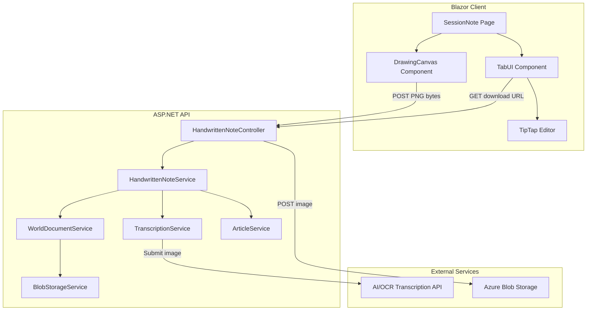

# Design Document: Handwritten Session Notes

## Overview

This feature adds a handwritten note capture workflow to Chronicis session notes. Users draw on an HTML5 Canvas (optimized for iPad stylus), save as PNG via existing WorldDocument infrastructure, and optionally transcribe to text using an AI/OCR service. The transcribed content then integrates with all existing session note features (WikiLinks, ExternalReferences, AI summaries).

The design leverages existing infrastructure (WorldDocument storage, TipTap editor, ArticleService) and introduces a new drawing canvas component, a transcription service integration, and a tab-based UI to separate handwritten and transcribed views within the session note article page.

## Architecture



### Key Architectural Decisions

1. **Server-side upload (not SAS direct upload):** Unlike the existing WorldDocument upload flow (which uses client-side SAS URLs), handwritten note images are posted directly to the API as byte arrays. Rationale: the canvas export produces an in-memory blob, and we need to validate, store, and optionally transcribe in a single request. This avoids a 3-step (request SAS → upload → confirm) flow for a single-purpose operation.

2. **Single HandwrittenNoteImageId per article:** Each session note article has at most one handwritten note. Re-saving replaces the previous one. This keeps the data model simple and matches the user mental model of "my handwritten note for this session."

3. **Transcription as a separate operation:** Save and transcribe are distinct actions. Users can save without transcribing, and transcribe later. The "Transcribe" button on the canvas triggers save-then-transcribe atomically.

4. **Reuse existing editor infrastructure:** The transcribed content tab renders the standard TipTap editor with all existing extensions (WikiLinks, ExternalReferences, formatting). No new editor work needed.

## Components and Interfaces

### Client Components

#### `DrawingCanvas.razor`
- **Location:** `src/Chronicis.Client/Components/Articles/DrawingCanvas.razor`
- **Responsibility:** Full-width HTML5 Canvas with stylus/touch/mouse input, pressure-sensitive stroke rendering, color picker, eraser, undo/redo.
- **Parameters:**
  - `EventCallback<byte[]> OnSave` — invoked with PNG bytes when user clicks Save
  - `EventCallback<byte[]> OnTranscribe` — invoked with PNG bytes when user clicks Transcribe
  - `bool IsSaving` — disables save/transcribe buttons during operation
- **JS Interop:** `drawingCanvas.js` handles pointer events, stroke storage, pressure mapping, and PNG export via `canvas.toBlob()`.

#### `HandwrittenNoteTabView.razor`
- **Location:** `src/Chronicis.Client/Components/Articles/HandwrittenNoteTabView.razor`
- **Responsibility:** MudTabs wrapper showing Handwritten (image) and Transcribed (TipTap editor) tabs.
- **Parameters:**
  - `string? ImageDownloadUrl` — SAS URL for the handwritten note image
  - `string? Body` — article body content for the TipTap editor
  - `bool ShowTranscribedTabActive` — whether to default to Transcribed tab
  - `EventCallback OnTranscribeRequested` — triggers transcription from the empty-state Transcribed tab
  - `EventCallback<string> OnBodyChanged` — content change callback for auto-save

### API Endpoints

#### `HandwrittenNoteController`
- **Location:** `src/Chronicis.Api/Controllers/HandwrittenNoteController.cs`
- **Base route:** `api/articles/{articleId}/handwritten-note`

| Method | Route | Description |
|--------|-------|-------------|
| POST | `/` | Upload/replace handwritten note PNG |
| POST | `/transcribe` | Save + transcribe handwritten note |
| GET | `/` | Get download URL for handwritten note image |
| DELETE | `/` | Delete handwritten note image |

### API Services

#### `IHandwrittenNoteService`
```csharp
public interface IHandwrittenNoteService
{
    Task<HandwrittenNoteSaveResultDto> SaveAsync(Guid articleId, Guid userId, byte[] imageBytes);
    Task<HandwrittenNoteTranscribeResultDto> TranscribeAsync(Guid articleId, Guid userId, byte[] imageBytes);
    Task<string?> GetImageDownloadUrlAsync(Guid articleId, Guid userId);
    Task DeleteAsync(Guid articleId, Guid userId);
}
```

#### `ITranscriptionService`
```csharp
public interface ITranscriptionService
{
    Task<TranscriptionResultDto> TranscribeImageAsync(byte[] imageBytes, CancellationToken cancellationToken = default);
}
```

### Client Services

#### `IHandwrittenNoteApiService`
```csharp
public interface IHandwrittenNoteApiService
{
    Task<HandwrittenNoteSaveResultDto?> SaveHandwrittenNoteAsync(Guid articleId, byte[] imageBytes);
    Task<HandwrittenNoteTranscribeResultDto?> TranscribeHandwrittenNoteAsync(Guid articleId, byte[] imageBytes);
    Task<string?> GetHandwrittenNoteUrlAsync(Guid articleId);
    Task<bool> DeleteHandwrittenNoteAsync(Guid articleId);
}
```

### DTOs

```csharp
public class HandwrittenNoteSaveResultDto
{
    public Guid DocumentId { get; set; }
    public string DownloadUrl { get; set; } = string.Empty;
}

public class HandwrittenNoteTranscribeResultDto
{
    public Guid DocumentId { get; set; }
    public string DownloadUrl { get; set; } = string.Empty;
    public string TranscribedText { get; set; } = string.Empty;
}

public class TranscriptionResultDto
{
    public bool Success { get; set; }
    public string Text { get; set; } = string.Empty;
    public string? ErrorMessage { get; set; }
}
```

## Data Models

### Article Model Change

Add a nullable foreign key to the `Article` entity:

```csharp
/// <summary>
/// FK to WorldDocument storing the handwritten note image for this session note.
/// Null for articles without handwritten notes or non-SessionNote article types.
/// </summary>
public Guid? HandwrittenNoteImageId { get; set; }

/// <summary>
/// Navigation property for the handwritten note image WorldDocument.
/// </summary>
public WorldDocument? HandwrittenNoteImage { get; set; }
```

### Database Migration

```sql
ALTER TABLE Articles
ADD HandwrittenNoteImageId UNIQUEIDENTIFIER NULL
    CONSTRAINT FK_Articles_WorldDocuments_HandwrittenNoteImageId
    REFERENCES WorldDocuments(Id);

CREATE INDEX IX_Articles_HandwrittenNoteImageId
ON Articles(HandwrittenNoteImageId)
WHERE HandwrittenNoteImageId IS NOT NULL;
```

### Storage Path Convention

Handwritten note blobs use the existing WorldDocument path pattern:
```
worlds/{worldId}/documents/{documentId}/handwritten-note.png
```

### Existing Model Reuse

- **WorldDocument** — stores the PNG with `ContentType = "image/png"`, `ArticleId` set to the session note article
- **Article.Body** — stores transcribed HTML content (same field used by typed notes)
- **ArticleDto** — extended with `HandwrittenNoteImageId` for client display decisions

## Correctness Properties

*A property is a characteristic or behavior that should hold true across all valid executions of a system — essentially, a formal statement about what the system should do. Properties serve as the bridge between human-readable specifications and machine-verifiable correctness guarantees.*

### Property 1: View State Determination

*For any* session note article, the page view state is determined solely by the presence of `HandwrittenNoteImageId`: when non-null the Tab_UI is displayed, when null the "Add a handwritten note" button is displayed. These two states are mutually exclusive.

**Validates: Requirements 1.1, 1.3, 5.1**

### Property 2: Pressure-to-Width Mapping

*For any* pressure value in the range [0.0, 1.0], the computed stroke width SHALL be in the range [1, 8] CSS pixels, and the mapping SHALL be monotonically non-decreasing (higher pressure never produces a thinner stroke).

**Validates: Requirements 2.2**

### Property 3: Undo/Redo Round-Trip

*For any* non-empty sequence of strokes on the canvas, performing an undo followed by a redo SHALL return the stroke list to the same state as before the undo was performed.

**Validates: Requirements 2.6**

### Property 4: Save Persists and Links Handwritten Note

*For any* valid PNG byte array and valid session note article, a successful save operation SHALL create a WorldDocument with `ContentType = "image/png"` and update the article's `HandwrittenNoteImageId` to reference that WorldDocument's Id.

**Validates: Requirements 3.3, 8.2**

### Property 5: Transcription Stores Result in Body

*For any* non-empty string returned by the Transcription_Service, a successful transcribe operation SHALL store that string in the Session_Note_Article's Body field.

**Validates: Requirements 4.3**

### Property 6: Summary Enablement Based on Body Content

*For any* session note article, the AI summary generation feature is enabled if and only if the Body field is non-null and contains at least one non-whitespace character.

**Validates: Requirements 7.1, 7.3**

### Property 7: Article Deletion Cascades to Handwritten Note Cleanup

*For any* session note article with a non-null `HandwrittenNoteImageId`, deleting the article SHALL also delete the associated WorldDocument record and its blob from storage.

**Validates: Requirements 8.3**

### Property 8: Replace Overwrites Old Handwritten Note

*For any* session note article that already has a `HandwrittenNoteImageId` referencing a WorldDocument, saving a new handwritten note SHALL delete the old WorldDocument (record + blob) and create a new WorldDocument, updating `HandwrittenNoteImageId` to the new document's Id.

**Validates: Requirements 8.6**

## Error Handling

| Scenario | Behavior |
|----------|----------|
| API fails to load article state | Show error alert, hide "Add handwritten note" button (Req 1.4) |
| Save operation fails | Display error snackbar with failure reason, re-enable Save button, preserve canvas content (Req 3.4) |
| Save fails during transcribe flow | Show save-specific error, do not call transcription, preserve canvas (Req 4.2) |
| Transcription returns empty text | Show "Transcription produced no text" error, image remains saved (Req 4.4) |
| Transcription times out (>60s) | Cancel via CancellationToken, show timeout error, image remains saved (Req 4.5) |
| Body overwrite confirmation declined | Cancel transcription flow, do not overwrite body, image remains saved (Req 4.7) |
| Auto-save fails during editing | Show error notification via Snackbar, retain unsaved changes in editor (Req 6.5) |
| Blob deletion fails during article delete | Log warning, proceed with database record deletion (Req 8.4) |
| AI summary generation fails | Show error with description, allow retry (Req 7.4) |

### Error Propagation Strategy

- **Client → API errors:** HTTP status codes mapped to user-friendly messages via existing `HttpClientExtensions` patterns
- **Service layer:** Throw typed exceptions (`InvalidOperationException`, `UnauthorizedAccessException`) caught by controller-level error handling
- **Transcription timeout:** Use `CancellationTokenSource` with 60-second timeout; `OperationCanceledException` mapped to timeout error response
- **Blob failures during cascading delete:** Catch at service layer, log, continue — consistent with existing `WorldDocumentService.DeleteDocumentAsync` pattern

## Testing Strategy

### Unit Testing (100% line and branch coverage per AGENTS.md)

All services and components will have full unit test coverage with mocked dependencies:

- **HandwrittenNoteService tests:** Mock `IWorldDocumentService`, `IBlobStorageService`, `ITranscriptionService`, `DbContext`
- **HandwrittenNoteController tests:** Mock `IHandwrittenNoteService`, verify HTTP responses and auth enforcement
- **HandwrittenNoteApiService tests:** Mock `HttpClient`, verify request/response serialization
- **View model/component logic tests:** Mock API service, verify state transitions (button vs tabs, save state, error state)

### Property-Based Testing

Property-based tests use **FsCheck** (already compatible with .NET 9 / xUnit) with minimum 100 iterations per property.

| Property | Test Focus | Library |
|----------|-----------|---------|
| Property 1: View State | Generate random `Guid?` for HandwrittenNoteImageId, verify view decision | FsCheck |
| Property 2: Pressure Mapping | Generate random floats in [0,1], verify width in [1,8] and monotonicity | FsCheck |
| Property 3: Undo/Redo | Generate random stroke sequences, verify round-trip | FsCheck |
| Property 4: Save Links | Generate random valid PNG stubs + article states, verify WorldDocument creation + FK | FsCheck |
| Property 5: Transcription Storage | Generate random non-empty strings, verify Body update | FsCheck |
| Property 6: Summary Enablement | Generate random nullable strings (null, empty, whitespace, content), verify enable/disable | FsCheck |
| Property 7: Cascade Delete | Generate articles with/without HandwrittenNoteImageId, verify cleanup on delete | FsCheck |
| Property 8: Replace | Generate articles with existing handwritten note, save new, verify old deleted + new linked | FsCheck |

**Tag format:** `// Feature: handwritten-session-notes, Property {N}: {description}`

### Example-Based Unit Tests

- Canvas tool palette has ≥6 colors including black, red, blue
- Save button disabled when stroke count = 0
- Post-save navigation returns to Tab_UI
- Post-transcription navigation activates Transcribed tab
- Overwrite confirmation shown when Body is non-empty before transcription
- Navigation guard prompts when leaving editor with unsaved changes

### Edge Case Tests

- Pressure = null → stroke width = 2px
- Blob deletion failure during article delete → logs warning, DB records still removed
- Save API failure → error shown, canvas preserved, button re-enabled
- Transcription timeout → error shown, image remains saved
- Empty transcription result → error shown, image remains saved
