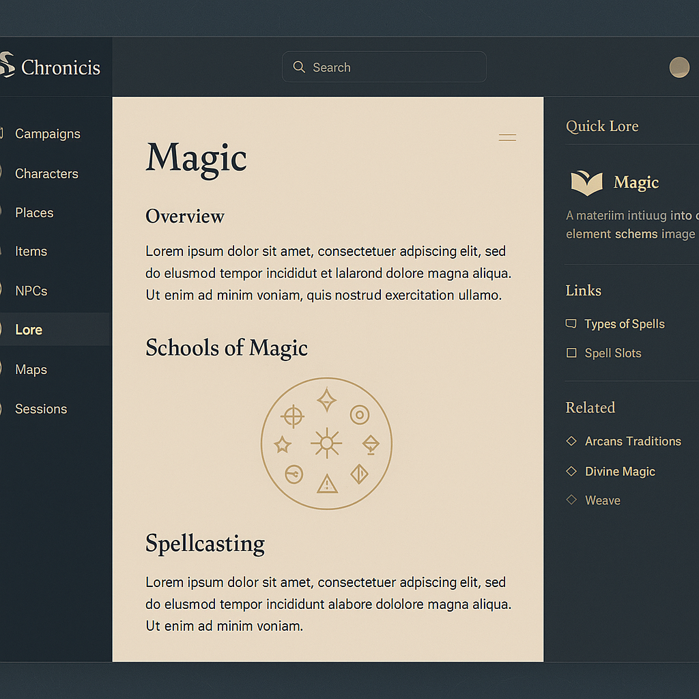

# Chronicis

<div align="center">
  
  
  **Your Chronicle Awaits**
  
  A modern knowledge management platform for tabletop RPG campaigns
  
  [](https://dotnet.microsoft.com/)
  [](https://dotnet.microsoft.com/apps/aspnet/web-apps/blazor)
  [](https://azure.microsoft.com/en-us/services/functions/)
  [](LICENSE)
</div>

---

## ⚠️ About This Project

**This is a learning exercise in AI-assisted development ("vibe coding").** The entire codebase has been generated through iterative conversations with Claude AI as part of exploring how software engineering managers can effectively guide and collaborate with AI coding assistants.

**What this means:**
- 🤖 All code is Claude-generated through conversational development
- 🎓 Primary goal is learning AI-assisted development workflows
- 🔬 Experimental approach to architecture and implementation
- 📚 Demonstrates what's achievable with AI pair programming
- 🚀 Fully functional and deployed to production

**Please judge accordingly!** This is about the journey of learning to work with AI tools, not about showcasing perfect code.

---

## 📖 About

Chronicis is a web-based knowledge management application designed specifically for Dungeons & Dragons and other tabletop RPG campaigns. Think of it as **Obsidian for D&D** — built with modern web technologies, it provides an elegant, efficient way to organize campaign notes, track entities, discover connections, and collaborate with your gaming group.

### ✨ Features

#### Content Management
- **Hierarchical Article Organization** - Nest articles infinitely deep to mirror your campaign structure
- **Wiki-Style Links** - `[[Article Name]]` syntax for intuitive cross-references with autocomplete
- **Inline WYSIWYG Editor** - Real-time rich text editing with TipTap
- **Auto-Save** - Never lose your work (automatic save on changes)
- **Drag & Drop** - Reorganize your content hierarchy with ease
- **Custom Icons** - Emoji icons for visual distinction in the tree

#### Campaign Structure
- **World → Campaign → Arc → Session** - Full taxonomy for organizing your games
- **Virtual Groups** - Automatic organization into Characters, Wiki, and Campaigns sections
- **Character Management** - Player and NPC profiles with claiming system
- **Session Notes** - Track what happened in each game session

#### Knowledge Discovery
- **Backlinks Panel** - See all articles that reference the current one
- **Full-Text Search** - Search across titles, content, and wiki links
- **AI Summaries** - Generate comprehensive entity summaries using Azure OpenAI
- **Context Snippets** - See where search terms appear in results

#### Collaboration
- **Multi-User Worlds** - Invite players with shareable codes (XXXX-XXXX format)
- **Role-Based Access** - Game Master, Player, and Observer roles
- **Private Articles** - Keep GM secrets hidden from players
- **Public Sharing** - Share your world publicly with a unique URL

#### Document Management
- **File Uploads** - Store PDFs, images, Word docs, Excel sheets, and more
- **200MB Limit** - Upload large battle maps and handouts
- **Azure Blob Storage** - Secure, scalable file storage

#### Data Portability
- **Export to Markdown** - Download your entire world as organized markdown files
- **YAML Frontmatter** - Metadata preserved in exports
- **Obsidian Compatible** - Folder structure works with Obsidian and similar tools

---

## 🎨 Design Philosophy

Chronicis follows an **Obsidian-inspired inline editing paradigm**:

- **Always Editable** - No modal dialogs; edit directly in place
- **Auto-Save** - Changes save automatically as you type
- **Hierarchical** - Infinitely nested articles mirror campaign structure
- **Connected** - Wiki links create automatic relationships between entities
- **Fast** - Optimized for quick note-taking during game sessions

### Visual Style

- **Color Palette**: Deep blue-grey (#1F2A33), beige-gold (#C4AF8E), soft off-white (#F4F0EA)
- **Typography**: Spellweaver Display (headings), Roboto (body)
- **Effects**: Soft gold glows, smooth transitions, subtle shadows
- **Theme**: Fantasy-inspired but modern and professional

---

## 🖼️ Screenshots

<div align="center">
  
</div>

---

## 🚀 Getting Started

### Prerequisites

- .NET 9 SDK
- Azure Functions Core Tools v4
- Visual Studio 2022 or VS Code with C# extension
- SQL Server (LocalDB, Express, or Docker)
- Azure subscription (for full deployment)

### Running Locally

```powershell
# Clone the repository
git clone https://github.com/munkycdev/chronicis.git
cd chronicis

# Set up the database
cd src\Chronicis.Api
dotnet ef database update

# Run API (terminal 1)
func start

# Run Client (terminal 2)
cd ..\Chronicis.Client
dotnet watch run
```

The client will be available at `https://localhost:5001` and the API at `http://localhost:7071`.

### Configuration

Create `local.settings.json` in the Api project:

```json
{
  "IsEncrypted": false,
  "Values": {
    "AzureWebJobsStorage": "UseDevelopmentStorage=true",
    "FUNCTIONS_WORKER_RUNTIME": "dotnet-isolated",
    "SqlConnectionString": "Server=(localdb)\\mssqllocaldb;Database=Chronicis;Trusted_Connection=True;"
  }
}
```

---

## 🏗️ Architecture

### Tech Stack

| Layer | Technology |
|-------|------------|
| Frontend | Blazor WebAssembly, MudBlazor, TipTap |
| Backend | Azure Functions (.NET 9 Isolated) |
| Database | Azure SQL Database, Entity Framework Core |
| Storage | Azure Blob Storage |
| Auth | Auth0 (Google, Discord OAuth) |
| AI | Azure OpenAI (GPT-4) |
| Hosting | Azure Static Web Apps |

### Project Structure

```
chronicis/
├── src/
│   ├── Chronicis.Client/      # Blazor WASM frontend
│   │   ├── Components/        # Razor components
│   │   ├── Pages/             # Route pages
│   │   ├── Services/          # API clients and state
│   │   └── wwwroot/           # Static assets, JS, CSS
│   ├── Chronicis.Api/         # Azure Functions backend
│   │   ├── Functions/         # HTTP endpoints
│   │   ├── Services/          # Business logic
│   │   ├── Data/              # EF Core DbContext
│   │   └── Infrastructure/    # Auth, middleware
│   ├── Chronicis.Shared/      # Shared models and DTOs
│   └── Chronicis.CaptureApp/  # Windows audio capture (prototype)
├── docs/                      # Documentation
└── Chronicis.sln
```

---

## 📚 Documentation

| Document | Description |
|----------|-------------|
| [QUICK-START.md](docs/QUICK-START.md) | User guide and tutorials |
| [STATUS.md](docs/STATUS.md) | Current project state and progress |
| [ARCHITECTURE.md](docs/ARCHITECTURE.md) | Technical architecture and data model |
| [FEATURES.md](docs/FEATURES.md) | Feature documentation and API reference |
| [CHANGELOG.md](docs/CHANGELOG.md) | Version history |
| [Feature Ideas.md](docs/Feature%20Ideas.md) | Backlog and future plans |

---

## 🗺️ Roadmap

### Completed ✅
- Core article management with hierarchical organization
- Wiki-style linking with autocomplete
- TipTap WYSIWYG editor with auto-save
- World/Campaign/Arc/Session taxonomy
- Multi-user collaboration with invitation codes
- Role-based access control (GM, Player, Observer)
- Private articles for GM secrets
- Public world sharing with unique URLs
- AI-powered summary generation
- Full-text search across all content
- Document upload and management
- Export to Markdown with metadata

### Planned 🔜
- Import from Obsidian/Notion
- Dark mode theme
- Mobile-optimized experience
- Real-time collaborative editing
- Session audio transcription integration
- Knowledge base Q&A (RAG)

---

## 🤝 Contributing

This is primarily a learning project, but suggestions and feedback are welcome! Feel free to:

- Open issues for bugs or feature ideas
- Submit PRs for improvements
- Share your experience using Chronicis for your campaigns

---

## 📝 License

This project is licensed under the MIT License - see the [LICENSE](LICENSE) file for details.

---

## 🙏 Acknowledgments

- **Claude by Anthropic** - AI pair programmer for the entire codebase
- **MudBlazor** - Excellent Blazor component library
- **TipTap** - Beautiful WYSIWYG editor
- **Auth0** - Authentication made easy
- **The D&D Community** - Inspiration for campaign management needs

---

<div align="center">
  
  **[Live Demo](https://chronicis.app)** · **[Documentation](docs/QUICK-START.md)** · **[Changelog](docs/CHANGELOG.md)**
  
  <sub>Built with Claude AI | Learning to vibe code, one feature at a time 🤖✨</sub>
  
</div>
